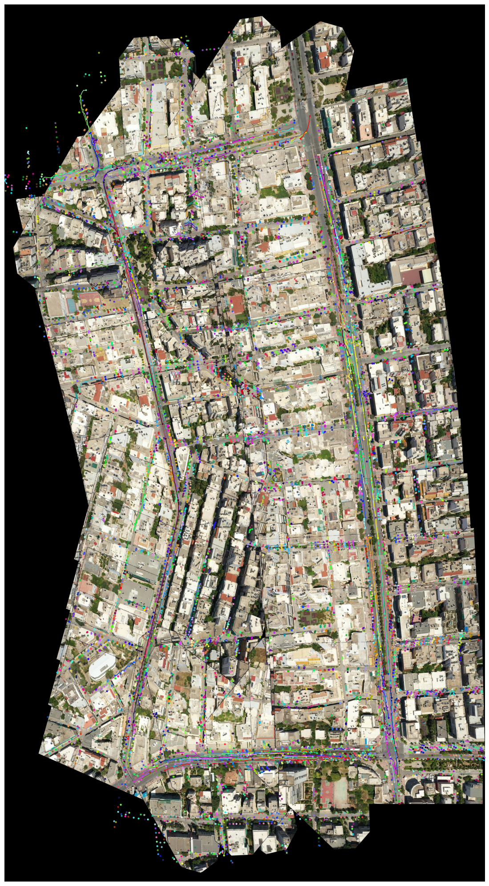

## Drone Map Creation and Vehicle Tracking on the Map  
**Semester Project, EPFL/LUTS (Jan 2025)** : 

### Brief Description  
Built an end-to-end system that stitches bird’s-eye drone images into a seamless high-resolution map and overlays tracked vehicle trajectories for traffic analysis.  

  
  

### Technologies Used  
- Python  
- OpenCV  
- LightGlue 
- LaMa  
- BoT-SORT  
- NumPy  
- pandas  

### My Contributions  
- **Frame Selection:** Automated selection of clear, evenly-spaced frames using GPS-based distance thresholds and blur detection.  
- **Two-Image Stitching:** Matched features with LightGlue, estimated homography via RANSAC, and applied padded warp-perspective to avoid cropping.  
- **Multi-Image Stitching:** Chained successive homographies against only the last stitched frame, updating a global panorama with cumulative transforms.  
- **Pre-Stitch Inpainting:** Removed moving vehicles using Simple LaMa to produce clean imagery for stitching.  
- **Vehicle Tracking:** Integrated BoT-SORT to assign unique track IDs to detected vehicles and export bounding-box centers per frame.  
- **Map-Trajectory Mapping:** Mapped frame-level trajectories to the panorama via batched homography and global translations.  
- **Trajectory Post-Processing:** Computed turn angles and bounding radii to classify trajectories into “good,” “small anomaly,” or “big anomaly” categories.  

### Outcome  
- Achieved **98.6 %** similarity between stitched and GPS trajectories (MED/RMSE).  
- Successfully mapped **95.4 %** of tracked vehicles onto the final panorama.  
